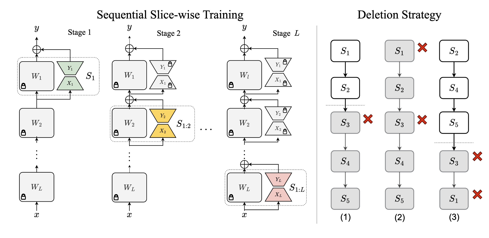

# Sequence-aware Sharded Sliced Training (S<sup>3</sup>T)

[](https://opensource.org/licenses/MIT)

We present the implementation of the ICLR 2025 paper:
> [**Towards Scalable Exact Machine Unlearning Using
Parameter-Efficient Fine-Tuning**](https://arxiv.org/pdf/2406.16257), <br>
[Somnath Basu Roy Chowdhury](https://www.cs.unc.edu/~somnath/), [Krzysztof Choromanski](https://scholar.google.com/citations?user=J8OgouwAAAAJ), [Arijit Sehanobish](https://scholar.google.co.in/citations?user=MEby6-QAAAAJ&hl=en), [Avinava Dubey](https://scholar.google.co.in/citations?user=tBbUAfsAAAAJ&hl=en), and [Snigdha Chaturvedi](https://sites.google.com/site/snigdhac/). <br>
UNC Chapel Hill

## Overview

  Machine unlearning is the process of efficiently removing the influence of a training data instance from a trained machine learning model without retraining it from scratch. A popular subclass of unlearning approaches is exact machine unlearning, which focuses on techniques that explicitly guarantee the removal of the influence of a data instance from a model. Exact unlearning approaches use a machine learning model in which individual components are trained on disjoint subsets of the data. During deletion, exact unlearning approaches only retrain the affected component rather than the entire model. While existing approaches reduce retraining costs, it can still be expensive for an organization to retrain a model component as it requires halting a system in production, which leads to service failure and adversely impacts customers.  To address these challenges, we introduce an exact unlearning framework -- Sequence-aware Sharded Sliced Training (S<sup>3</sup>T), which is designed to enhance the deletion capabilities of an exact unlearning system while minimizing the impact on model's performance. At the core of S<sup>3</sup>T, we utilize a lightweight parameter-efficient fine-tuning approach that enables parameter isolation by sequentially training layers with disjoint data slices. This enables efficient unlearning by simply deactivating the layers affected by data deletion. Furthermore, to reduce the retraining cost and improve model performance, we train the model on multiple data sequences, which allows S<sup>3</sup>T to handle an increased number of deletion requests. Both theoretically and empirically, we demonstrate that S<sup>3</sup>T attains superior deletion capabilities and enhanced performance compared to baselines across a wide range of settings. 

  


  ## Installation

  The simplest way to run our implementation is to create with a new conda environment.

```
conda create -n s3t python=3.9
source activate s3t
pip install -r requirements.txt
```

## Running S<sup>3</sup>T

We perform slice-wise training on classes of models: small LMs (RoBERTA<sub>LARGE</sub>), vision Transformers (ViTs), and LLMs (Llama-2 & Llama-3). 

To run experiments on GLUE and SUPERGLUE use the following command:
```
cd scripts/
chmod +x run_base.sh
./run_base [GPU_ID] [dataset_name] [benchmark] [lora_rank] [learning_rate] [epochs] [save_steps] [num_slices]
```
In the above command, use the `[dataset_name]` of any GLUE or SuperGLUE benchmark, and the `[benchmark]` can be either `glue` or `superglue`. 
 
To run experiments using vision Transformers use the following command:

```
cd scripts/
chmod +x run_vit.sh
./run_vit [GPU_ID] [start_id] [num_slices] [model] [dataset]
```
In the above command, `[slice_id]` indicates the slice from which you want to start training. `[model]` can be either `vit-base` or `vit-large`, `[dataset]` can be `cifar10` or `cifar100`.

To run experiments for instruction tuning use the following command:

```
cd scripts/
chmod +x run_llm.sh
./run_llm [GPU_ID] [start_id] [num_slices] [num_loras] [lora_rank] [model]
```

In the above command, `[model]` can be either `llama-7b`, `llama3-8b` or `llama-13b`.

To run S<sup>3</sup>T on full budget using vision transformers run the following command.

```
cd scripts/
chmod +x run_fullbudget.sh
./run_fullbudget [GPU_ID]
```

## Reference
If you use our work, please cite our paper as:
```
@inproceedings{chowdhury2025towards,
title={Towards Scalable Exact Machine Unlearning Using Parameter-Efficient Fine-Tuning},
author={Somnath Basu Roy Chowdhury and 
        Krzysztof Marcin Choromanski and 
        Arijit Sehanobish and 
        Kumar Avinava Dubey and 
        Snigdha Chaturvedi},
booktitle={The Thirteenth International Conference on Learning Representations},
year={2025},
url={https://openreview.net/forum?id=oe51Q5Uo37}
}
```